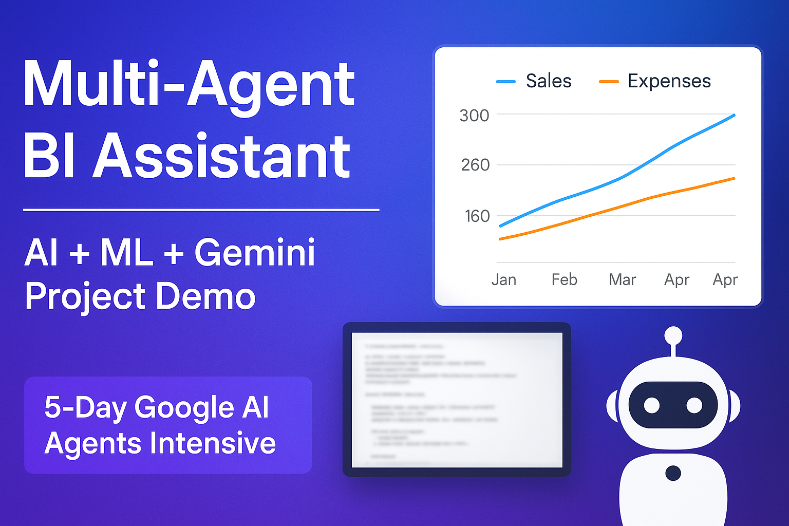
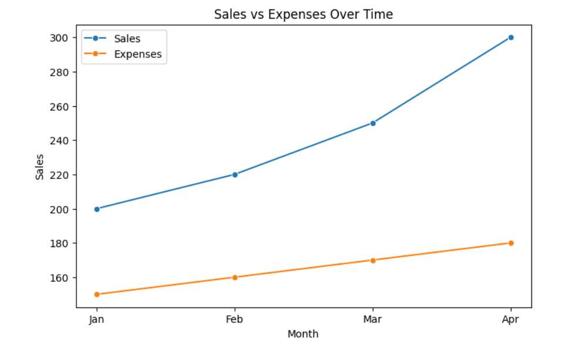
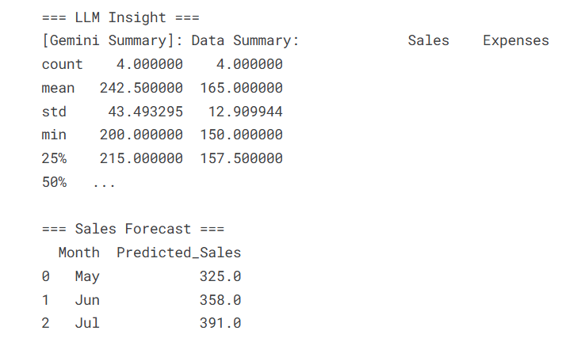

# Multi-Agent Business Intelligence Assistant  
Kaggle 5-Day AI Agents Intensive Course — Capstone Project  

---

## 📌 Project Thumbnail  


---

## 🧠 Overview  
This project implements a multi-agent system to automate business analytics including:  
- Data collection  
- Statistical analysis  
- Insight generation using Gemini  
- Visualizations  
- Sales forecasting  

---

## 🧱 Architecture  


**Pipeline:**  
Data Collector → Analysis Agent → Insight Agent → Visualization Agent → Prediction Agent  

---

## 📊 Analysis Output  


---

## 📈 Visualization Plot  


---

## 🔮 Sales Forecast  & LLM insights


---

## 📺 Video  
Project demo (Kaggle submission):
👉 *Paste your YouTube unlisted video link here*

---

## 🚀 Features  
- Multi-Agent Orchestration  
- Gemini LLM Integration  
- Predictive Modeling  
- Visualization Generation  
- Session Memory  
- Detailed Logging  

---

## 📦 How to Run  

```bash
pip install -r requirements.txt
